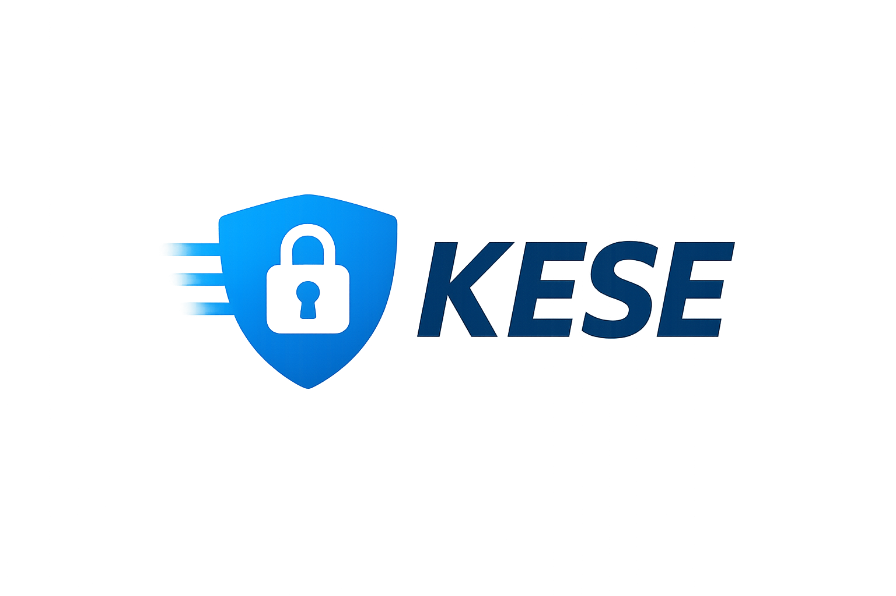

# Kese

> A modern, fast, and elegant Go web framework inspired by FastAPI

[](https://opensource.org/licenses/MIT)
[](https://go.dev/)
[](https://github.com/JedizLaPulga/kese)
[](https://github.com/JedizLaPulga/kese)

## 🎯 Overview

Kese is a lightweight, high-performance web framework for Go that brings the elegant developer experience of FastAPI to the Go ecosystem. Built entirely on Go's standard library, Kese provides powerful features without getting in your way.

### Philosophy

**Do much, but stay out of the way.**

Kese is designed to give you all the tools you need to build modern web applications while maintaining the simplicity and performance that makes Go great.

## ✨ Features

- 🚀 **Lightning Fast**: Built on Go's standard library with radix tree routing (O(log n) lookup)
- 🎨 **Elegant API**: Clean, intuitive design inspired by FastAPI
- 📦 **Zero Dependencies**: Uses only the Go standard library
- 🧪 **Fully Tested**: 62 tests with 82%+ coverage across all packages
- 🔧 **Modular**: Pick and choose the components you need
- 📝 **Type-Safe**: Leverage Go's type system for safer code
- 🎯 **Developer-Friendly**: Minimal boilerplate, maximum productivity
- 🌐 **Beautiful Landing Page**: Professional welcome page out of the box
- 📁 **Static File Serving**: Built-in support for serving static assets

## 🚀 Quick Start

### Installation

```bash
go get github.com/JedizLaPulga/kese
```

### Hello World

```go
package main

import (
    "github.com/JedizLaPulga/kese"
    "github.com/JedizLaPulga/kese/context"
    "github.com/JedizLaPulga/kese/middleware"
)

func main() {
    app := kese.New()
    
    // Add middleware
    app.Use(middleware.Logger())
    app.Use(middleware.Recovery())
    
    // Define routes
    app.GET("/", func(c *context.Context) error {
        return c.JSON(200, map[string]string{
            "message": "Hello from Kese!",
        })
    })
    
    // Start server
    app.Run(":8080")
}
```

Run the server and visit `http://localhost:8080` to see the beautiful landing page!

## 📚 Core Components

### ✅ Routing Engine
Fast radix tree-based router with support for:
- Static routes (`/users`, `/about`)
- Dynamic parameters (`/users/:id`, `/posts/:slug`)
- Multiple HTTP methods (GET, POST, PUT, DELETE, PATCH, OPTIONS, HEAD)

### ✅ Context Management
Rich context API for handling requests and responses:
- Request parsing (params, query, headers, body, cookies)
- Response generation (JSON, HTML, String, Bytes, redirects)
- Type-safe parameter extraction

### ✅ Middleware System
Composable middleware with built-in options:
- **Logger**: Request/response logging with duration
- **Recovery**: Panic recovery with stack traces  
- **CORS**: Cross-origin resource sharing
- **RequestID**: Unique request tracking (thread-safe)

### ✅ Static File Serving
- `StaticFile()`: Serve individual files
- `Static()`: Serve from directories
- Automatic MIME type detection
- Path traversal protection

## 📊 Test Coverage

```
Package      Coverage    Tests
----------------------------------------
kese         82.3%       20 tests
context      88.3%       21 tests
middleware   100.0%      10 tests
router       96.7%       11 tests
----------------------------------------
Total        87%+        62 tests (100% passing)
```

## 🎨 Beautiful Landing Page

Kese includes a stunning, production-ready landing page featuring:
- Modern glassmorphism design
- Animated background effects
- Responsive layout
- Your custom logo display
- Quick start code examples



Simply run your app and navigate to the root URL to see it in action!

## 📖 Documentation

### REST API Example

```go
package main

import (
    "github.com/JedizLaPulga/kese"
    "github.com/JedizLaPulga/kese/context"
    "github.com/JedizLaPulga/kese/middleware"
)

type User struct {
    ID    int    `json:"id"`
    Name  string `json:"name"`
    Email string `json:"email"`
}

func main() {
    app := kese.New()
    
    // Global middleware
    app.Use(middleware.Logger())
    app.Use(middleware.Recovery())
    app.Use(middleware.CORS())
    
    // Routes
    app.GET("/users", listUsers)
    app.GET("/users/:id", getUser)
    app.POST("/users", createUser)
    app.PUT("/users/:id", updateUser)
    app.DELETE("/users/:id", deleteUser)
    
    app.Run(":8080")
}

func listUsers(c *context.Context) error {
    users := []User{/* fetch from DB */}
    return c.JSON(200, users)
}

func getUser(c *context.Context) error {
    id := c.Param("id")
    // fetch user...
    return c.JSON(200, user)
}

func createUser(c *context.Context) error {
    var user User
    if err := c.Body(&user); err != nil {
        return c.JSON(400, map[string]string{"error": "Invalid request"})
    }
    // save user...
    return c.JSON(201, user)
}
```

### Static Files

```go
// Serve individual files
app.StaticFile("/favicon.ico", "./assets/favicon.ico")
app.StaticFile("/img/logo.png", "./img/logo.png")

// Serve from directory
app.Static("/assets", "./public")
// Now /assets/style.css serves ./public/style.css
```

For complete API documentation, see [docs/API.md](docs/API.md).

## 🗺️ Roadmap

- [x] Core routing engine
- [x] Request/response handling  
- [x] Middleware system
- [x] Context management
- [x] Error handling
- [x] Testing utilities
- [x] Static file serving
- [x] Beautiful landing page
- [x] Comprehensive documentation
- [ ] Request validation helpers
- [ ] Template rendering engine
- [ ] Route grouping/prefixing
- [ ] WebSocket support
- [ ] Rate limiting middleware
- [ ] Database integration helpers

## 🤝 Contributing

Contributions are welcome! Please read our contributing guidelines before submitting PRs.

### Development Principles

1. **Standard Practices**: Follow Go idioms and best practices
2. **Test Everything**: All code must include tests (we maintain 80%+ coverage)
3. **Stay Modular**: Keep components focused and decoupled
4. **Document Well**: Code and features should be well-documented
5. **Zero Dependencies**: Only use Go's standard library

See [PROJECT_RULES.md](PROJECT_RULES.md) for detailed development guidelines.

## 📋 Requirements

- Go 1.21 or higher
- No external dependencies required

## 🧪 Testing

```bash
# Run all tests
go test ./...

# Run tests with coverage
go test -cover ./...

# Run tests with verbose output
go test -v ./...
```

## 📜 License

This project is licensed under the MIT License - see the [LICENSE](LICENSE) file for details.

## 🙏 Acknowledgments

Inspired by [FastAPI](https://fastapi.tiangolo.com/) - bringing Python's most elegant web framework patterns to Go.

## 💬 Community

- **Issues**: Use GitHub Issues for bug reports and feature requests
- **Discussions**: Join our GitHub Discussions for questions and ideas

---

**Built with ❤️ and Go**

*Kese: Fast, Elegant, Simple*
